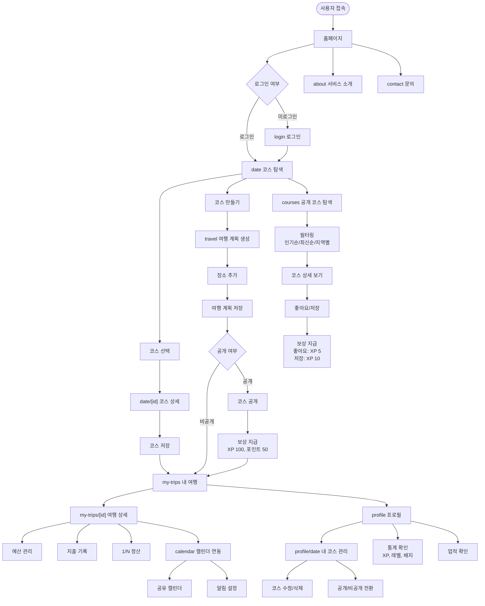
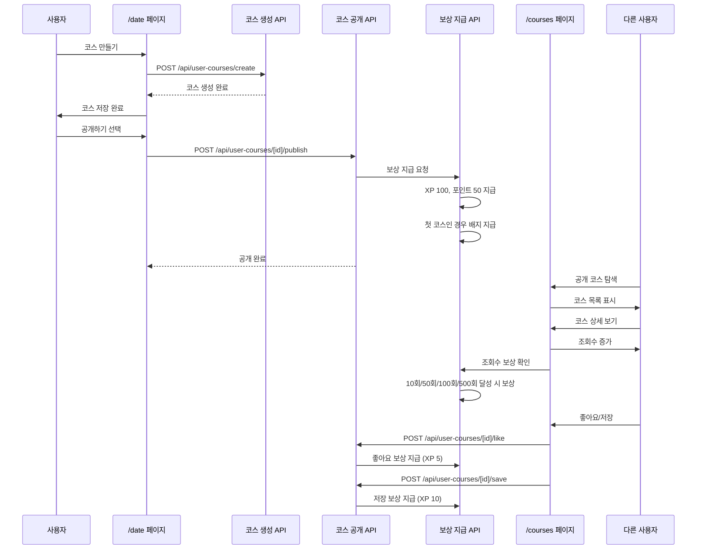
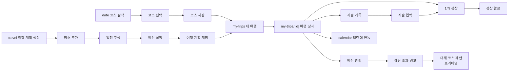
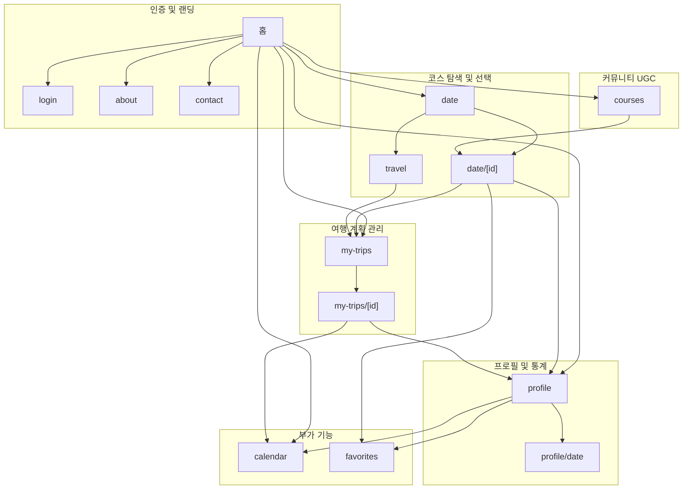

# 💕 LOVETRIP - 여행 추천 서비스

> 데이트 코스와 여행 코스를 찾는 모든 사람을 위해 교통편, 숙소, 데이트 장소, 경비를 한 번에 추천해주는 맞춤형 여행 서비스

[](https://nextjs.org/)
[](https://react.dev/)
[](https://www.typescriptlang.org/)
[](https://supabase.com/)

## 📋 목차

- [서비스 개요](#서비스-개요)
- [주요 기능](#주요-기능)
- [프로젝트 구조](#프로젝트-구조)
- [페이지 구조](#페이지-구조)
- [페이지 워크플로우](#페이지-워크플로우)
- [시작하기](#시작하기)
- [기술 스택](#기술-스택)

## 🎯 서비스 개요

### 핵심 가치

- **공동 여행 설계 툴**: 함께 사용할 수 있는 협업형 여행 계획 도구
- **UGC 데이트 코스 플랫폼**: 사용자들이 직접 만든 데이트 코스를 탐색하고, 나만의 코스를 제작해 공유하는 커뮤니티
- **올인원 플랫폼**: 여행 계획부터 추억 저장(앨범, 지출 기록)까지 모든 기능 제공

### 타깃 고객

- 데이트 코스와 여행 코스를 찾는 모든 사람
- 커플, 친구, 가족, 혼자, 비즈니스 등 다양한 타겟 오디언스
- 국내 1박 2일 ~ 3박 4일 여행을 계획하는 사람들
- 여행 코스를 공유하고 탐색하고 싶은 사람들

### 해결하는 문제

1. ❌ **경비 계산·분담의 번거로움** → ✅ 자동 예산 관리 및 1/N 정산 기능
2. ❌ **여러 사이트를 오가며 검색해야 하는 불편** → ✅ 교통편+숙소+데이트 장소 통합 추천
3. ❌ **분위기 좋은 장소 찾기의 어려움** → ✅ 타겟별 맞춤형 테마 코스 제공 (커플/친구/가족/혼자/비즈니스)

## ✨ 주요 기능

### 1. 여행 추천 & 일정 플래너 ✅

- 출발지, 목적지, 예산, 일정 입력 시 → 최적 교통편+숙소+데이트 코스 자동 생성
- Tour API 기반 실시간 관광 정보 제공
- 네이버 지도 통합으로 직관적인 코스 확인

### 2. 데이트 장소 큐레이션 ✅

- 지역별 **분위기 좋은 카페, 레스토랑, 야경 명소, 전시회, 드라이브 코스** 추천
- 타겟별 맞춤 추천: 커플, 친구, 가족, 혼자, 비즈니스에 맞는 장소 정보 제공
- 테마별 추천: 로맨틱, 힐링, 액티브, 기념일, 야경, 카페투어

### 3. 예산/경비 관리 ✅

- 예상 경비 자동 산출 (교통, 숙소, 식사, 입장료 포함)
- 지출 내역 기록 & 1/N 정산 기능
- 예산 초과 시 대안 코스 제안 (프리미엄)
- 영수증 촬영으로 자동 지출 기록

### 4. 사용자 생성 코스 공유 커뮤니티 (UGC) ✅

- 내가 만든 여행/데이트 코스를 공개하여 다른 사용자들과 공유
- 공개 코스 탐색: 인기순, 최신순, 지역별, 타겟별, 테마별 필터링
- 좋아요/저장 기능으로 마음에 드는 코스 북마크
- 실제 다녀온 후기 및 사진 공유

### 5. 게이미피케이션 보상 시스템 ✅

- 코스 공개 시 즉시 보상: XP 100, 포인트 50, 첫 코스 공개 시 배지
- 다른 사용자의 좋아요/저장 시 추가 보상
- 조회수 기준 보상 (일일 10회/50회/100회/500회 달성 시)
- 주간 인기 코스 TOP 10 작성자 보너스 보상
- 레벨 시스템 및 업적/배지 수집

### 6. 커플 전용 기능 ✅

- 커플 연결 및 공동 캘린더
- 여행 일정 공유
- 비용 분할 및 청산 추적
- 즐겨찾기 장소 공유

### 7. 구독 모델 ✅

- 프리미엄 구독: 테마 코스, AI 일정 재편성, 예산 최적화, 기념일 알림 등
- 무료 사용자: 기본 코스 및 기능 제공
- 프리미엄 기능 체크 및 구독 전환 유도

### 8. 푸시 알림 ✅

- 웹 푸시 알림 지원 (VAPID)
- 서비스 워커 기반 백그라운드 알림
- 사용자별 알림 구독 관리

## 🚧 구현 예정 / 부분 구현 기능

### 1. 여행 추억 앨범 ✅

- **상태**: 구현 완료
- **설명**: 여행 사진을 업로드하고 관리하는 앨범 기능
- **데이터베이스**: `travel_memories` 테이블 생성 완료
- **서비스 코드**: `packages/planner/services/travel-memory-service.ts`
- **API**: `/api/travel-plans/[id]/memories`
- **기능**: 사진 업로드, 태그, 위치 정보, 커플 공유 (프리미엄)

### 2. 예약 리마인더 ✅

- **상태**: 구현 완료
- **설명**: 레스토랑, 호텔 등 예약 일정 리마인더 기능
- **데이터베이스**: `reservation_reminders` 테이블 생성 완료
- **서비스 코드**: `packages/couple/services/reservation-service.ts`
- **기능**: 예약 일정 관리, 알림 시간 설정, 푸시 알림 연동

### 4. AI 일정 재편성 ⚠️

- **상태**: 부분 구현 (프리미엄 기능으로 정의되어 있으나 실제 AI 로직 미구현)
- **설명**: 프리미엄 사용자를 위한 AI 기반 일정 최적화 기능
- **현재**: 프리미엄 기능 체크만 구현됨

### 5. 예산 최적화 대안 코스 ⚠️

- **상태**: 부분 구현 (기본 예산 최적화는 구현됨, AI 추천은 미구현)
- **설명**: 예산 초과 시 AI가 제안하는 대안 코스
- **현재**: `packages/expense/services/budget-service.ts`에 기본 최적화 로직 존재

## 📁 프로젝트 구조

pnpm workspace 기반 모노레포 구조:

```
love-trip/
├── apps/web/              # Next.js 웹 애플리케이션
└── packages/              # 공유 패키지
    ├── ui/                # UI 컴포넌트
    ├── api/               # Supabase 클라이언트
    ├── user/              # 사용자/인증
    ├── couple/            # 커플 기능
    ├── planner/           # 여행 계획
    ├── expense/           # 경비/정산
    ├── gamification/      # 게이미피케이션
    └── crawler/           # Tour API 크롤러
```

## 📄 페이지 구조

Next.js App Router 기반의 주요 페이지:

### 인증 및 랜딩

| 경로       | 역할                               | 주요 기능                                   |
| ---------- | ---------------------------------- | ------------------------------------------- |
| `/`        | **홈페이지** - 서비스 소개 및 랜딩 | 서비스 소개, 주요 기능 안내, 여행 계획 시작 |
| `/login`   | **로그인 페이지** - 사용자 인증    | 이메일/Google/Kakao 로그인, 회원가입        |
| `/about`   | **서비스 소개** - 정적 페이지      | 서비스 개요, 팀 소개                        |
| `/contact` | **문의하기** - 정적 페이지         | 고객 문의 폼                                |
| `/privacy` | **개인정보처리방침** - 정적 페이지 | 개인정보 처리 방침                          |
| `/terms`   | **이용약관** - 정적 페이지         | 서비스 이용약관                             |

### 코스 탐색 및 선택

| 경로         | 역할                                                      | 주요 기능                                                                                                 |
| ------------ | --------------------------------------------------------- | --------------------------------------------------------------------------------------------------------- |
| `/date`      | **데이트/여행 코스 탐색 및 선택** - 메인 코스 탐색 페이지 | 네이버 지도 기반 코스 시각화, 사이드바에서 코스 목록 탐색, 코스 타입 전환 (데이트/여행), 코스 만들기 기능 |
| `/date/[id]` | **코스 상세 정보** - 선택한 코스의 상세 정보 표시         | 코스 정보, 장소 목록, 지도 표시, 코스 저장 기능                                                           |
| `/travel`    | **여행 계획 생성** - 커스텀 여행 계획 생성                | 여행 일정 생성, 장소 추가 및 순서 조정                                                                    |

### 커뮤니티 (UGC)

| 경로       | 역할                                                            | 주요 기능                                                                       |
| ---------- | --------------------------------------------------------------- | ------------------------------------------------------------------------------- |
| `/courses` | **공개 코스 탐색** - 사용자 생성 코스(UGC) 커뮤니티 탐색 페이지 | 인기순/최신순/지역별/테마별 필터링, 좋아요/저장 기능, 프리미엄 사용자 고급 필터 |

### 여행 계획 관리

| 경로             | 역할                                            | 주요 기능                                                 |
| ---------------- | ----------------------------------------------- | --------------------------------------------------------- |
| `/my-trips`      | **내 여행 계획 목록** - 저장된 여행 계획 관리   | 여행 계획 목록, 여행 상태별 필터링 (계획 중/진행 중/완료) |
| `/my-trips/[id]` | **여행 계획 상세** - 개별 여행 계획의 상세 관리 | 일정 관리, 예산 관리, 지출 기록, 1/N 정산 기능, 함께 공유 |

### 프로필 및 통계

| 경로            | 역할                                                    | 주요 기능                                                                                          |
| --------------- | ------------------------------------------------------- | -------------------------------------------------------------------------------------------------- |
| `/profile`      | **사용자 프로필 및 통계** - 게이미피케이션 및 여행 통계 | 게이미피케이션 통계 (XP, 레벨, 배지), 여행 통계 (완료한 여행, 방문한 장소), 업적 및 배지 수집 현황 |
| `/profile/date` | **내가 만든 코스 관리** - 사용자가 생성한 코스 관리     | 공개한 코스 목록, 코스 공개/비공개 설정, 코스 수정 및 삭제                                         |

### 부가 기능

| 경로         | 역할                                 | 주요 기능                                                 |
| ------------ | ------------------------------------ | --------------------------------------------------------- |
| `/calendar`  | **공유 캘린더** - 일정 공유 및 관리  | 일정 공유 및 관리, 기념일 알림 (프리미엄), 푸시 알림 설정 |
| `/favorites` | **즐겨찾기 장소** - 저장한 장소 관리 | 저장한 장소 목록, 장소별 상세 정보                        |

## 🔄 페이지 워크플로우

### 전체 사용자 플로우



### 코스 공개 및 보상 플로우



### 여행 계획 및 예산 관리 플로우



### 전체 네비게이션 구조



## 📊 데이터베이스 상태

### Supabase MCP를 통한 마이그레이션 관리

이 프로젝트는 Supabase MCP (Model Context Protocol)를 통해 데이터베이스 마이그레이션을 관리합니다.

**프로젝트 ID**: `dyomownljgsbwaxnljau`

### 주요 테이블 구조

#### ✅ 구현 완료된 테이블

- **여행 계획**: `travel_plans`, `travel_days`, `travel_day_places`
- **예산 관리**: `budget_items`, `expenses`, `expense_splits`
- **커플 기능**: `couples`, `shared_calendars`, `calendar_events`
- **코스 관리**: `user_courses`, `user_course_places`, `user_course_likes`, `user_course_saves`
- **게이미피케이션**: `user_gamification`, `user_badges`, `user_achievements`
- **구독**: `subscriptions`
- **푸시 알림**: `push_subscriptions`
- **프로필**: `profiles` (온보딩 완료 필드 포함)
- **장소**: `place_favorites`

#### ✅ 최근 구현된 테이블

- `travel_memories`: 여행 추억 앨범 (2025-01-20 구현 완료)
- `reservation_reminders`: 예약 리마인더 (2025-01-20 구현 완료)

### 마이그레이션 관리

자세한 내용은 [Supabase MCP 마이그레이션 가이드](./docs/SUPABASE_MCP_MIGRATION.md)를 참조하세요.

## 🚀 시작하기

### 필수 요구사항

- Node.js >= 18.0.0
- pnpm >= 8.0.0
- Supabase 프로젝트
- Tour API 키 (공공데이터포털에서 발급)
- 네이버 클라우드 플랫폼 지도 API 키

### 1. 저장소 클론

```bash
git clone <repository-url>
cd love-trip
```

### 2. 의존성 설치

```bash
pnpm install
```

### 3. 환경 변수 설정

루트 디렉토리에 `.env.local` 파일을 생성하고 다음 환경 변수를 설정하세요:

```env
# Supabase 설정 (필수)
NEXT_PUBLIC_SUPABASE_URL=your_supabase_project_url
NEXT_PUBLIC_SUPABASE_ANON_KEY=your_supabase_anon_key
SUPABASE_SERVICE_ROLE_KEY=your_supabase_service_role_key

# 네이버 지도 API (필수)
NEXT_PUBLIC_NAVER_CLOUD_API_KEY_ID=your_naver_map_client_id
NEXT_PUBLIC_NAVER_CLOUD_API_KEY=your_naver_cloud_api_key
```

> ⚠️ **중요**: `.env.local` 파일은 Git에 커밋하지 마세요. 자세한 설정 방법은 [개발 가이드](./docs/development-guide.md)를 참조하세요.

### 4. 개발 서버 실행

```bash
pnpm dev
```

브라우저에서 [http://localhost:3000](http://localhost:3000)을 열어 확인하세요.

## 🛠 기술 스택

**Frontend:** Next.js 16.0.7, React 19.2.1, TypeScript 5.6, Tailwind CSS, Radix UI, Framer Motion  
**Backend:** Supabase (PostgreSQL, 인증, 실시간 구독)  
**External APIs:** 네이버 지도 API  
**개발 도구:** pnpm, ESLint, Prettier, Vitest, Cypress

## ⚡ 성능 최적화

### 적용된 최적화 기법

1. **서버 컴포넌트 최적화**
   - React.cache()로 요청당 중복 호출 방지
   - 병렬 데이터 페칭 (Promise.all)
   - 배치 조회로 N+1 쿼리 문제 해결

2. **클라이언트 컴포넌트 최적화**
   - useMemo로 필터링 로직 최적화
   - React.memo로 리렌더링 최적화
   - useCallback으로 함수 메모이제이션

3. **번들 최적화**
   - Dynamic import (NaverMapView 등)
   - 직접 import로 tree-shaking 최적화
   - 코드 스플리팅

4. **데이터 페칭 최적화**
   - 배치 조회로 데이터베이스 쿼리 최소화
   - 병렬 페칭으로 워터폴 제거

자세한 내용은 [성능 최적화 요약](./docs/PERFORMANCE_OPTIMIZATION_SUMMARY.md)을 참조하세요.

## 📝 주요 스크립트

```bash
pnpm dev          # 개발 서버 실행
pnpm build        # 프로덕션 빌드
pnpm test         # Unit 테스트 실행
pnpm lint         # 코드 린트
```

## 🤝 기여하기

이 프로젝트는 개인 프로젝트입니다. 버그 리포트나 기능 제안은 이슈로 등록해주세요.

## 📄 라이선스

이 프로젝트는 **AGPL-3.0 (GNU Affero General Public License v3.0)** 라이선스 하에 배포됩니다.

### 라이선스 요약

- ✅ **개인 사용 및 학습 목적**: 자유롭게 사용, 수정, 배포 가능
- ✅ **오픈소스 프로젝트**: AGPL-3.0 조건 하에 사용 가능
- ⚠️ **웹 서비스 배포**: 수정된 버전을 웹 서비스로 배포할 경우, 전체 소스 코드를 AGPL-3.0으로 공개해야 함
- ❌ **상업적 이용**: 명시적 허가 없이 상업적 목적으로 서비스화 불가

### 상업적 이용 및 라이선싱

이 소프트웨어를 상업적 목적으로 사용하거나, 소스 코드 공개 없이 서비스로 배포하고 싶으신 경우, 별도의 상업용 라이선스가 필요합니다.

상업용 라이선스 문의: [ironjustlikethat@gmail.com]

자세한 내용은 [LICENSE](./LICENSE) 파일을 참조하세요.

## 🔗 관련 문서

- [프로젝트 기획서](./docs/project-plan.md) - 서비스 기획 및 기능 명세
- [아키텍처 문서](./docs/architecture.md) - 시스템 구조 및 설계 원칙
- [개발 가이드](./docs/development-guide.md) - 개발 환경 설정 가이드
- [API 명세서](./docs/api-spec.md) - REST API 엔드포인트 문서
- [Supabase MCP 마이그레이션 가이드](./docs/SUPABASE_MCP_MIGRATION.md) - 데이터베이스 마이그레이션 관리

자세한 문서는 `docs/` 폴더를 참조하세요.

## 📝 구현 상태 요약

### ✅ 완전 구현된 기능

- 여행 추천 & 일정 플래너
- 데이트 장소 큐레이션
- 예산/경비 관리 (1/N 정산 포함)
- 사용자 생성 코스 공유 커뮤니티 (UGC)
- 게이미피케이션 보상 시스템
- 커플 전용 기능 (연결, 캘린더, 일정 공유)
- 구독 모델 (프리미엄/무료 구분)
- 푸시 알림
- 영수증 업로드
- 온보딩 완료 추적
- 여행 추억 앨범 (2025-01-20 추가)
- 예약 리마인더 (2025-01-20 추가)

### ⚠️ 부분 구현된 기능

- AI 일정 재편성 (프리미엄 기능 체크만 구현)
- 예산 최적화 대안 코스 (기본 로직만 구현, AI 추천 미구현)

### ❌ 미구현 기능

- 여행 추억 앨범 (데이터베이스 테이블 없음)
- 기념일 알림 (서비스 코드는 있으나 데이터베이스 테이블 없음)
- 예약 리마인더 (서비스 코드는 있으나 데이터베이스 테이블 없음)

---

**Made with 💕 for everyone**
