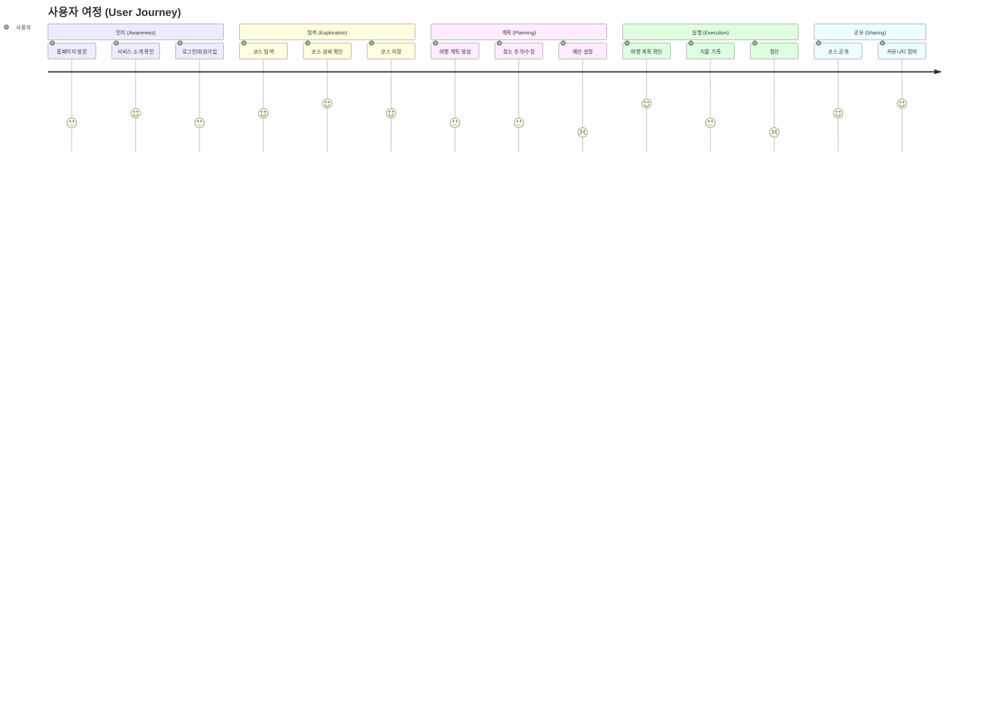
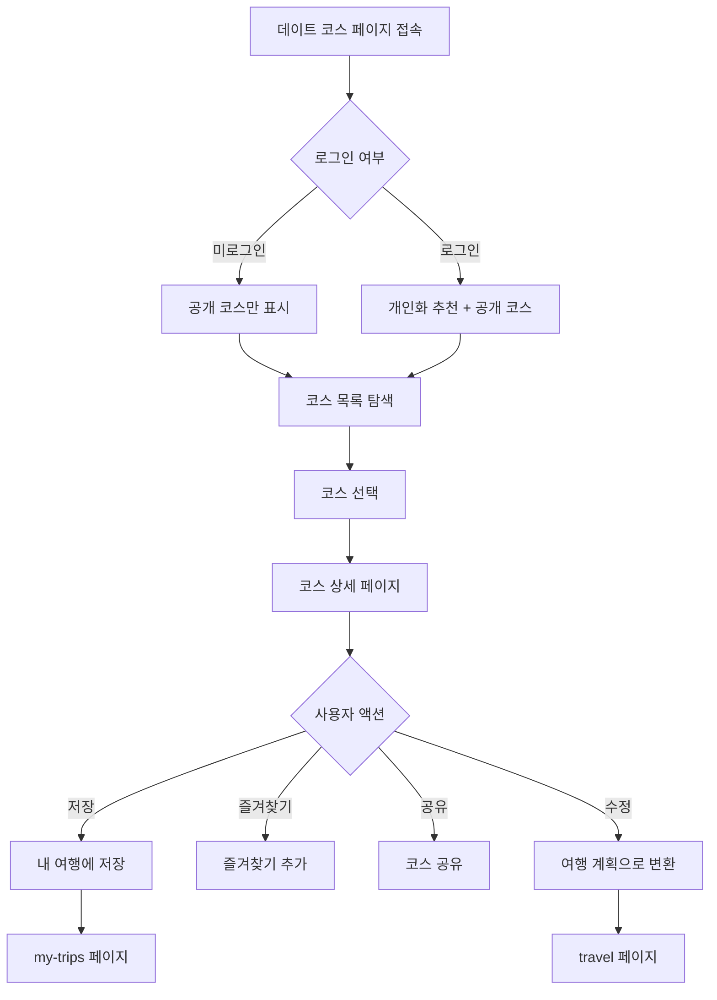
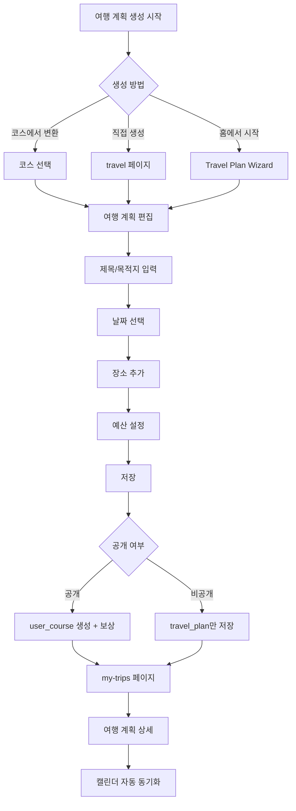
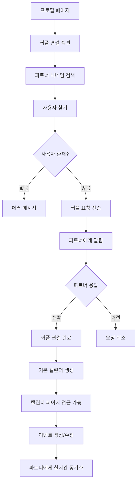
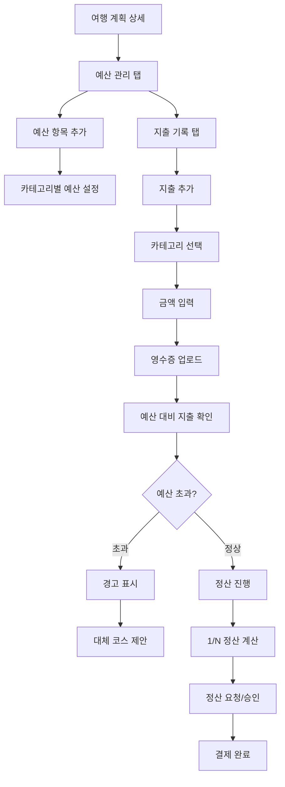
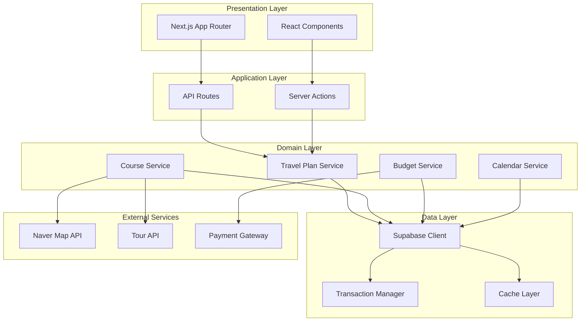
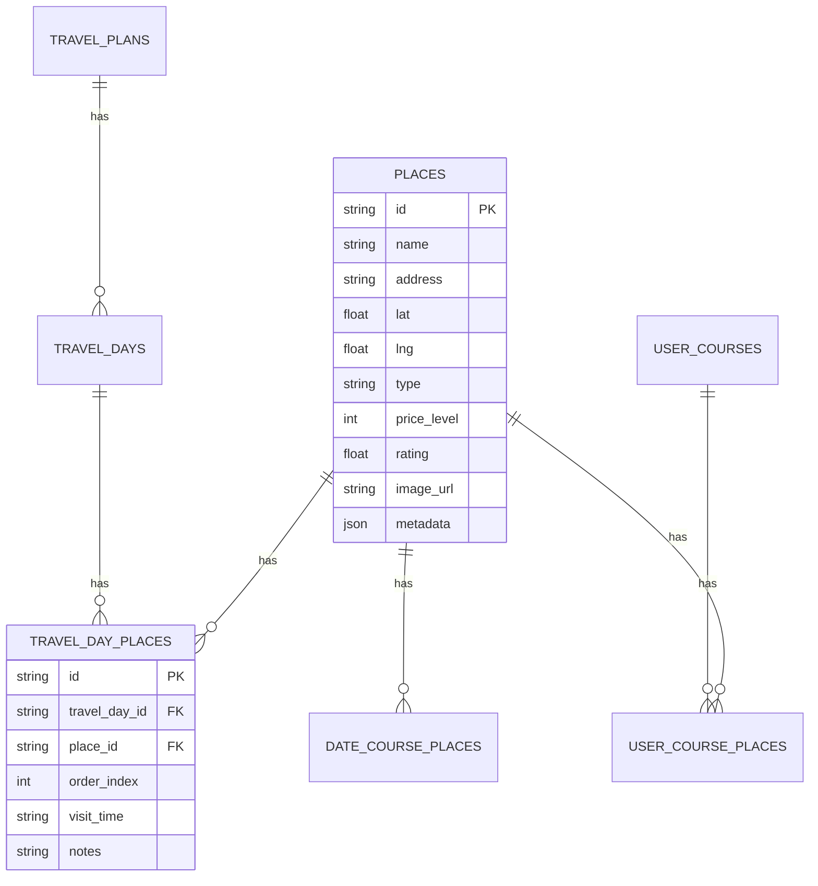

# LOVETRIP 사용자 플로우 분석 및 서비스 설계 개선 방안

**작성 일자**: 2025-01-27  
**분석 범위**: 전체 사용자 여정 및 서비스 설계

---

## 📋 목차

1. [사용자 여정 분석](#1-사용자-여정-분석)
2. [주요 사용자 플로우 상세 분석](#2-주요-사용자-플로우-상세-분석)
3. [플로우별 문제점 및 개선점](#3-플로우별-문제점-및-개선점)
4. [서비스 설계 개선 방안](#4-서비스-설계-개선-방안)
5. [UX/UI 개선 제안](#5-uxui-개선-제안)
6. [기술적 개선 사항](#6-기술적-개선-사항)

---

## 1. 사용자 여정 분석

### 1.1 사용자 페르소나

#### 주요 타겟 사용자

1. **신규 커플 (온보딩 단계)**
   - 첫 여행 계획을 세우는 커플
   - 서비스에 대한 이해가 낮음
   - 가이드와 추천이 필요함

2. **활발한 사용자 (활성 단계)**
   - 정기적으로 여행을 계획하는 커플
   - 커플 연결 완료
   - 예산 관리 및 정산 기능 활용

3. **커뮤니티 참여자 (참여 단계)**
   - 자신의 코스를 공개하는 사용자
   - 다른 사용자의 코스를 탐색하고 저장
   - 게이미피케이션 요소에 관심

### 1.2 사용자 여정 맵



---

## 2. 주요 사용자 플로우 상세 분석

### 2.1 온보딩 플로우

#### 현재 플로우

```
홈페이지 (/)
  → 로그인/회원가입 (/login)
  → 홈으로 리다이렉트 (/)
  → 코스 탐색 시작 (/date 또는 /travel)
```

#### 발견된 문제점

1. **온보딩 가이드 부재**
   - 신규 사용자에게 서비스 사용법 안내 없음
   - 첫 여행 계획 생성 시 도움말 부족

2. **커플 연결 유도 부족**
   - 커플 연결의 이점이 명확하지 않음
   - 연결 방법이 프로필 페이지에만 있음

#### 개선 방안

1. **온보딩 퍼널 추가**

   ```
   로그인 완료
     → 온보딩 1: 서비스 소개 (3-5 슬라이드)
     → 온보딩 2: 커플 연결 안내
     → 온보딩 3: 첫 여행 계획 만들기 가이드
     → 메인 화면
   ```

2. **커플 연결 CTA 강화**
   - 홈페이지에 커플 연결 배너 추가
   - 첫 여행 계획 생성 시 커플 연결 유도

### 2.2 코스 탐색 및 선택 플로우

#### 현재 플로우

```
코스 탐색 페이지 (/date, /travel, /courses)
  → 코스 목록 표시
  → 코스 선택
  → 코스 상세 (/date/[id])
  → 코스 저장 또는 여행 계획으로 변환
```

#### 플로우 상세 분석

**A. 데이트 코스 탐색 (`/date`)**



**발견된 문제점:**

1. **장소 정보 부족**
   - `places` 테이블 삭제로 인해 장소 상세 정보 표시 불가
   - 코스 상세 페이지에서 장소 정보가 제한적

2. **필터링 기능 제한**
   - 지역별, 테마별 필터링이 제한적
   - 가격대별 필터링 없음

3. **추천 알고리즘 부재**
   - 개인화된 추천이 제한적
   - 즐겨찾기 기반 추천 비활성화

**개선 방안:**

1. **장소 정보 복구**
   - 외부 API (네이버 지도, 한국관광공사) 활용
   - `travel_day_places`에서 저장된 정보 활용

2. **고급 필터링 추가**
   - 지역, 테마, 가격대, 평점 필터
   - 프리미엄 사용자 전용 필터

3. **추천 시스템 개선**
   - 사용자 선호도 기반 추천
   - 협업 필터링 알고리즘 도입

### 2.3 여행 계획 생성 플로우

#### 현재 플로우



#### 발견된 문제점

1. **트랜잭션 일관성 부족**
   - 여러 단계의 작업이 원자적으로 처리되지 않음
   - 부분 실패 시 데이터 불일치 가능성

2. **에러 피드백 부족**
   - 사용자에게 명확한 에러 메시지 제공 부족
   - 부분 실패 시 사용자가 인지하기 어려움

3. **진행 상황 표시 부족**
   - 다단계 프로세스에서 진행 상황 표시 없음
   - 저장 중 상태 표시 부족

#### 개선 방안

1. **트랜잭션 도입**

   ```typescript
   // 개선된 여행 계획 생성
   async function createTravelPlanWithTransaction(data) {
     const transaction = await supabase.rpc("begin_transaction")
     try {
       // 1. travel_plan 생성
       // 2. travel_days 생성
       // 3. travel_day_places 생성
       // 4. budget_items 생성
       // 5. 캘린더 이벤트 추가
       // 6. user_course 생성 (선택적)

       await supabase.rpc("commit_transaction", { transaction_id: transaction.id })
       return { success: true }
     } catch (error) {
       await supabase.rpc("rollback_transaction", { transaction_id: transaction.id })
       throw error
     }
   }
   ```

2. **진행 상황 표시**
   - 단계별 진행 바 추가
   - 각 단계 완료 시 체크마크 표시

3. **에러 처리 개선**
   - 사용자 친화적인 에러 메시지
   - 재시도 옵션 제공

### 2.4 커플 연결 및 캘린더 플로우

#### 현재 플로우



#### 발견된 문제점

1. **알림 시스템 부족**
   - 커플 요청 알림이 명확하지 않음
   - 푸시 알림 설정이 복잡함

2. **캘린더 동기화 지연**
   - 실시간 동기화가 완벽하지 않을 수 있음
   - 충돌 해결 메커니즘 부족

#### 개선 방안

1. **알림 시스템 강화**
   - 이메일 알림 추가
   - 인앱 알림 개선
   - 푸시 알림 설정 간소화

2. **실시간 동기화 개선**
   - Supabase Realtime 활용
   - 충돌 해결 UI 추가

### 2.5 예산 및 지출 관리 플로우

#### 현재 플로우



#### 발견된 문제점

1. **예산 추정 도움 부족**
   - 사용자가 예산을 설정하기 어려움
   - 장소별 예상 비용 안내 부족

2. **지출 입력 UX 복잡**
   - 영수증 업로드가 번거로움
   - OCR 기능 없음

3. **정산 프로세스 복잡**
   - 정산 요청/승인 플로우가 명확하지 않음
   - 결제 연동 없음

#### 개선 방안

1. **스마트 예산 추정**
   - 장소별 평균 비용 제시
   - AI 기반 예산 추천

2. **지출 입력 간소화**
   - OCR 기능 추가 (영수증 자동 인식)
   - 카드 내역 연동 (선택적)

3. **정산 프로세스 개선**
   - 자동 정산 옵션
   - 간편 결제 연동

---

## 3. 플로우별 문제점 및 개선점

### 3.1 Critical 플로우 문제점

#### 1. 코스 탐색 → 저장 플로우

**현재 상태:**

- `places` 테이블 삭제로 인해 장소 정보 부족
- 코스 상세 정보가 제한적

**영향:**

- 사용자 만족도 저하
- 코스 선택 의사결정 어려움

**우선순위:** 🔴 Critical

#### 2. 여행 계획 생성 플로우

**현재 상태:**

- 트랜잭션 부재
- 부분 실패 시 데이터 불일치

**영향:**

- 데이터 무결성 문제
- 사용자 신뢰도 저하

**우선순위:** 🔴 Critical

### 3.2 High Priority 플로우 문제점

#### 1. 온보딩 플로우

**현재 상태:**

- 온보딩 가이드 부재
- 첫 사용자 경험 부족

**영향:**

- 이탈률 증가
- 기능 활용도 저하

**우선순위:** ⚠️ High

#### 2. 커플 연결 플로우

**현재 상태:**

- 알림 시스템 부족
- 연결 유도 부족

**영향:**

- 커플 연결률 저하
- 핵심 기능 활용도 저하

**우선순위:** ⚠️ High

### 3.3 Medium Priority 플로우 문제점

#### 1. 예산 관리 플로우

**현재 상태:**

- 예산 추정 도움 부족
- 지출 입력 UX 복잡

**영향:**

- 기능 사용률 저하
- 사용자 불편

**우선순위:** ⚠️ Medium

---

## 4. 서비스 설계 개선 방안

### 4.1 아키텍처 개선

#### 현재 아키텍처 문제점

1. **데이터 소스 분산**
   - `places` 테이블 삭제로 인한 데이터 소스 혼란
   - 여러 테이블에 장소 정보가 분산

2. **트랜잭션 부재**
   - 다중 테이블 작업 시 일관성 보장 어려움

#### 개선된 아키텍처 제안



**주요 개선 사항:**

1. **Transaction Manager 도입**
   - 모든 다중 테이블 작업에 트랜잭션 적용
   - 롤백 전략 구현

2. **Cache Layer 강화**
   - Redis 또는 유사한 솔루션 도입
   - 장소 정보 캐싱

3. **External Services 통합**
   - 네이버 지도 API 통합
   - 한국관광공사 Tour API 통합
   - 결제 게이트웨이 통합

### 4.2 데이터 모델 개선

#### 현재 문제점

1. **장소 정보 부족**
   - `places` 테이블 삭제
   - 장소 정보가 여러 테이블에 분산

2. **관계 모델 복잡**
   - `travel_plans` → `travel_days` → `travel_day_places`
   - `user_courses` → `user_course_places`

#### 개선된 데이터 모델 제안



**주요 개선 사항:**

1. **Places 테이블 복구 또는 대체**
   - 새로운 `places` 테이블 설계
   - 또는 외부 API 기반 하이브리드 모델

2. **정규화 개선**
   - 장소 정보 중앙화
   - 관계 명확화

### 4.3 서비스 레이어 개선

#### 현재 문제점

1. **비즈니스 로직 분산**
   - API 라우트에 비즈니스 로직 포함
   - 서비스 레이어 활용 부족

2. **에러 처리 불일치**
   - 에러 클래스 정의되어 있으나 사용 빈도 낮음
   - 에러 응답 형식 불일치

#### 개선 방안

1. **서비스 레이어 강화**

   ```typescript
   // 개선된 서비스 구조
   packages/planner/services/
   ├── travel-plan-service.ts      // 여행 계획 비즈니스 로직
   ├── course-service.ts            // 코스 비즈니스 로직
   └── place-service.ts            // 장소 비즈니스 로직

   packages/expense/services/
   ├── budget-service.ts            // 예산 비즈니스 로직
   ├── expense-service.ts          // 지출 비즈니스 로직
   └── settlement-service.ts       // 정산 비즈니스 로직
   ```

2. **에러 처리 표준화**

   ```typescript
   // 표준화된 에러 처리
   import { ValidationError, NotFoundError } from "@lovetrip/shared/types/errors"

   export async function createTravelPlan(data: CreateTravelPlanInput) {
     // 입력 검증
     if (!data.title) {
       throw new ValidationError("제목은 필수입니다")
     }

     // 비즈니스 로직
     // ...

     // 에러 처리
     if (!plan) {
       throw new NotFoundError("여행 계획을 찾을 수 없습니다")
     }
   }
   ```

---

## 5. UX/UI 개선 제안

### 5.1 온보딩 개선

#### 제안 사항

1. **인터랙티브 온보딩**
   - 단계별 가이드
   - 실제 기능 체험
   - 진행 상황 표시

2. **컨텍스트 기반 도움말**
   - 첫 사용 시 툴팁 표시
   - 상황별 도움말 제공

### 5.2 코스 탐색 개선

#### 제안 사항

1. **향상된 필터링**
   - 다중 필터 조합
   - 필터 저장 기능
   - 추천 필터

2. **시각적 개선**
   - 지도 기반 탐색 강화
   - 이미지 갤러리
   - 360도 뷰 (가능한 경우)

### 5.3 여행 계획 생성 개선

#### 제안 사항

1. **드래그 앤 드롭 인터페이스**
   - 장소 순서 조정
   - 일정 간 이동

2. **스마트 제안**
   - AI 기반 장소 추천
   - 최적 경로 제안
   - 예산 기반 추천

### 5.4 예산 관리 개선

#### 제안 사항

1. **시각화 강화**
   - 차트 및 그래프
   - 예산 대비 지출 시각화
   - 카테고리별 분포

2. **자동화 기능**
   - 영수증 OCR
   - 카드 내역 연동
   - 자동 카테고리 분류

---

## 6. 기술적 개선 사항

### 6.1 즉시 조치 필요 (Critical)

1. **Places 테이블 대체 방안**
   - 외부 API 통합
   - 하이브리드 데이터 모델 설계
   - 마이그레이션 계획 수립

2. **트랜잭션 도입**
   - Supabase 트랜잭션 활용
   - 롤백 전략 구현
   - 에러 처리 개선

### 6.2 단기 개선 (High Priority)

1. **입력 검증 강화**
   - Zod 도입
   - 모든 API 라우트에 검증 추가
   - 클라이언트 사이드 검증

2. **에러 처리 표준화**
   - 에러 클래스 활용
   - 일관된 에러 응답
   - 에러 로깅 개선

3. **캐싱 전략 개선**
   - 서버 사이드 캐싱 도입
   - Redis 또는 유사한 솔루션
   - 캐시 무효화 전략

### 6.3 중기 개선 (Medium Priority)

1. **성능 최적화**
   - 쿼리 최적화
   - N+1 쿼리 해결
   - 코드 스플리팅 개선

2. **모니터링 및 로깅**
   - 에러 추적 시스템
   - 성능 모니터링
   - 사용자 행동 분석

### 6.4 장기 개선 (Low Priority)

1. **테스트 커버리지 향상**
   - 단위 테스트
   - 통합 테스트
   - E2E 테스트

2. **문서화 개선**
   - API 문서화
   - 아키텍처 문서 업데이트
   - 사용자 가이드

---

## 7. 우선순위별 실행 계획

### Phase 1: Critical Issues (1-2주)

1. **Places 테이블 대체**
   - [ ] 외부 API 통합 설계
   - [ ] 하이브리드 데이터 모델 구현
   - [ ] 마이그레이션 스크립트 작성

2. **트랜잭션 도입**
   - [ ] Transaction Manager 구현
   - [ ] 여행 계획 생성에 트랜잭션 적용
   - [ ] 롤백 전략 구현

### Phase 2: High Priority (2-4주)

1. **입력 검증 강화**
   - [ ] Zod 도입
   - [ ] API 라우트 검증 추가
   - [ ] 클라이언트 검증 추가

2. **온보딩 개선**
   - [ ] 온보딩 퍼널 설계
   - [ ] 인터랙티브 가이드 구현
   - [ ] A/B 테스트

3. **에러 처리 표준화**
   - [ ] 에러 클래스 활용
   - [ ] 에러 응답 표준화
   - [ ] 에러 로깅 개선

### Phase 3: Medium Priority (1-2개월)

1. **성능 최적화**
   - [ ] 쿼리 프로파일링
   - [ ] N+1 쿼리 해결
   - [ ] 캐싱 전략 개선

2. **UX/UI 개선**
   - [ ] 코스 탐색 UI 개선
   - [ ] 여행 계획 생성 UX 개선
   - [ ] 예산 관리 시각화

### Phase 4: Long-term (2-3개월)

1. **고급 기능 추가**
   - [ ] AI 기반 추천
   - [ ] OCR 기능
   - [ ] 결제 연동

2. **모니터링 및 분석**
   - [ ] 에러 추적 시스템
   - [ ] 성능 모니터링
   - [ ] 사용자 행동 분석

---

## 8. 결론

LOVETRIP 서비스는 커플 여행 계획이라는 명확한 가치 제안을 가지고 있으며, 전반적으로 잘 설계된 아키텍처를 보유하고 있습니다. 그러나 몇 가지 중요한 개선점이 발견되었습니다:

### 핵심 개선 사항

1. **데이터 일관성**: Places 테이블 복구 및 트랜잭션 도입
2. **사용자 경험**: 온보딩 개선 및 UX 향상
3. **기능 완성도**: 추천 시스템 개선 및 고급 기능 추가

### 성공 지표

개선 후 측정할 주요 지표:

- **사용자 이탈률**: 온보딩 완료율
- **기능 활용도**: 여행 계획 생성률, 커플 연결률
- **사용자 만족도**: NPS (Net Promoter Score)
- **기술적 지표**: 에러율, 응답 시간, 트랜잭션 성공률

이러한 개선 사항들을 단계적으로 구현하면 LOVETRIP 서비스의 사용자 경험과 기술적 안정성이 크게 향상될 것입니다.

---

**작성자**: AI Assistant  
**검토 필요**: 프로젝트 팀 리더, UX 디자이너, 백엔드 개발자
